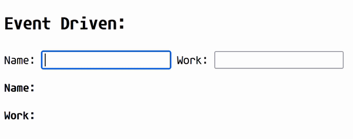
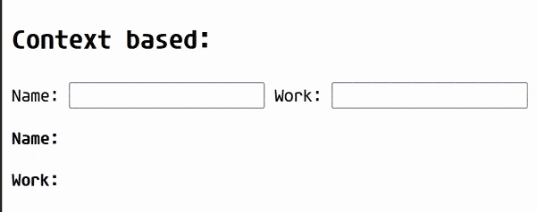

---
## The Architectural Pitfall Behind React

[React assumes that components act as pure functions (returning the same JSX for the same inputs)](https://react.dev/learn/keeping-components-pure). React components are functions that return React elements (JSX). These elements describe the UI tree. Components may contain state, hooks, and local logic, but their primary role is to describe UI based on inputs.


Each of these nodes can have its own state and uses it to build the user interface.

### The Achilles Heel of React

If the state of the `Form` component is modified, this needs to somehow be reflected in the DOM. How does React handle state change in this component? And its children `Input 1` and `Input 2`? Would they be affected by this state change?

For React to know what changed from one point to another, it calls the function that declares each of these components recursively (the parent, the parent's children, the parent's children's children...) to the end of the branch. After calling all the functions, React compares the new element tree with the previous one and generates a minimal set of DOM mutations if any change is detected.

This behavior, despite being direct, simple, and having guaranteed React the Top spot in the hall of web technologies, brought a disadvantage inherent to the model itself: state changes cause component functions to re-execute down the tree, even when most of the subtree does not depend on that state.

> Frameworks such as Solid and modern Angular adopt fine-grained reactivity through signals, where updates propagate only to computations that depend on the changed value.

In the beginning, when React was built, web applications and websites used to be simpler and less ambitious. As the web evolved and grew, more complex needs arose, and with them, heavier components, which increased the cost of re-renders on the web. This is not a design flaw in React. It’s a deliberate architectural trade-off that favors predictability and simplicity over fine-grained reactivity.

#### Caution...

Because of this, a lot of effort is spent on strategies like `react-compiler` (a compiler that adds automatic memoization), `useMemo`, `useCallback`, and `memo` (these functions ensure the component/state is kept and reused through a cache, except when a variable in the dependency array changes). However, putting memo everywhere, besides making your code MUCH more verbose...

> *Having a cache has a trade-off – while it saves memory required for computation and time from having to calculate things, it requires memory for storing old values. - [Wing*](https://stackoverflow.com/a/77145000)

## What If Components Didn’t Re-Render?

Before moving on to the actual implementation, I will show two examples: the first uses an `Event-Driven` approach to communicate changes to components, and the second uses the traditional approach with `useContext`. In both examples, I placed a `console.log` at the root of each component to allow us to observe the reconstruction of the component tree when a state is updated.

### Event-Driven Example



_The library making the components flash is [React Scan](https://react-scan.com/). It visually informs you when a component has re-rendered._

Initial render:

```
app rerendered
form rerendered
input name rerendered
input work rerendered
name rerendered
work rerendered
```

After typing in the `name` input:

```
name rerendered
```

After typing in the `work` input:

```
work rerendered
```

Not even the input component itself re-rendered, only the Name and Work components re-rendered when typing in the inputs.

### Context/Provider Example


Initial render:

```
app rerendered
form rerendered
input name rerendered
input work rerendered
name rerendered
work rerendered
```

After typing in the `name` input:

```
input name rerendered
input work rerendered
name rerendered
work rerendered
```

After typing in the `work` input:

```
input name rerendered
input work rerendered
name rerendered
work rerendered
```

The difference is staggering.

### Why does this happen?

Although a `useContext` approach allows moving data just as fluidly through the component tree (and more directly), it carries an inevitable trade-off due to how React handles state updates: when a state changes, the component and its children are rebuilt. Since the context is right above the Name and Work components, all of its children are rebuilt when a state is modified.


## Event-Driven State: The Alternative

> Event-driven architecture is made up of event producers (publishers) and event consumers (subscribers)[...]. After an event has been detected, it is transmitted from the event producer to the event consumers through event channels, where an event processing platform processes the event..." [- What is event-driven architecture?](https://www.redhat.com/en/topics/integration/what-is-event-driven-architecture)

(Analogy) Producers grow tomatoes and potatoes, and cooks (consumers) use the tomatoes and potatoes to create recipes (pizzas, pastas, mashed potatoes). The producers send their products to the cooks as soon as they are ready. Therefore, there is no need for the cook to know how, where, or why the tomatoes and potatoes were grown; they simply receive the potatoes and use them to create their recipes.

This approach allows us to move state out of React and control how data flows through the application, so we can handpick which components listen to which changes. The tomato cooks (and only them) will re-render only when the tomato producers send them tomatoes (and the same goes for the potato ones), regardless of where the producers or consumers are in the component tree.


## Building an Event-Driven Store From Scratch

> This pattern is essentially the same external store model used internally by libraries like Zustand and Redux. So this article can also help you better visualize the data flow using these libraries.

### `PubSub` Implementation:

```TSX
export type EventMapBase = Record<string, unknown>;  
  
type Listener = () => void;  
  
export class PubSub<Events extends EventMapBase> {  
  private listeners = new Map<keyof Events, Set<Listener>>();  
  private snapshots = new Map<keyof Events, Events[keyof Events]>();  
  
  // The subscribe method is responsible for listening to emitted events.
  subscribe<K extends keyof Events>(  
    eventName: K,  
    listener: Listener,  
  ): () => void {  
    const currentListeners =  
      this.listeners.get(eventName) ?? new Set<Listener>();  
  
    currentListeners.add(listener);  
    this.listeners.set(eventName, currentListeners);  
  
    return () => {  
      currentListeners.delete(listener);  
  
      if (currentListeners.size === 0) {  
        this.listeners.delete(eventName);  
      }  
    };  
  }  
  
  // The publish method is responsible for executing the functions that
  // are listening to a specific event.
  publish<K extends keyof Events>(eventName: K, payload: Events[K]): void {  
    this.snapshots.set(eventName, payload);  
  
    const currentListeners = this.listeners.get(eventName);  
  
    if (!currentListeners) {  
      return;  
    }  
  
    currentListeners.forEach((listener) => {  
      listener();  
    });  
  }  
  
  getSnapshot<K extends keyof Events>(eventName: K): Events[K] | undefined {  
    return this.snapshots.get(eventName) as Events[K] | undefined;  
  }  
}

```

This is a basic implementation of `PubSub`, which will be our centerpiece for creating an event-driven architecture, allowing the data flow outside of React.

> `EventEmitter` and `Observables` are also types of PubSub (or vice versa). It's also common for methods to be called `on`, `listen`, `emit`, `notify`, etc.

> While in the example the `PubSub` has very apparent limitations, such as being only synchronous, not being fault-tolerant, and executing listeners concurrently. In production, your `PubSub` must be much more robust and fault-tolerant than the current example to ensure an efficient solution.

### `useSubscribe` Implementation:

`useSubscribe` is one of the two bridges between `PubSub` and React. The hook receives a `PubSub` instance and the identifier of the event to be consumed, integrating it with React using the [useSyncExternalStore](https://react.dev/reference/react/useSyncExternalStore) hook:

```tsx
import { useMemo, useSyncExternalStore } from "react";  
import { type EventMapBase, PubSub } from "./pub-sub";  
  
export function useSubscribe<  
  Events extends EventMapBase,  
  K extends keyof Events,  
>(pubSub: PubSub<Events>, eventName: K) { 
  
  // The `subscribe` function is responsible for notifying `useSyncExternalStore` that a new value is available: 
  const subscribe = useMemo(() => {  
    return (onStoreChange: () => void) =>  
      pubSub.subscribe(eventName, onStoreChange);  
  }, [pubSub, eventName]);
  // The `getSnapshot` function returns the latest value emitted by the PubSub:
  
  const getSnapshot = useMemo(() => {  
    return () => pubSub.getSnapshot(eventName);  
  }, [pubSub, eventName]);  
  
  return useSyncExternalStore(subscribe, getSnapshot, getSnapshot);  
}

```

This ensures that components created after events are emitted still receive the most up-to-date data. (The PubSub is capable of informing what the last emitted value was for an event `x`).

### `usePublish` Implementation:

`usePublish` is the second bridge between `PubSub` and React. The hook is simple: it receives a `PubSub` instance and the `event identifier` to be produced and returns a factory function for those events.

```tsx
import { PubSub, type EventMapBase } from "./pub-sub";  
import { useCallback } from "react";  
  
export function usePublish<Events extends EventMapBase, K extends keyof Events>(  
  pubSub: PubSub<Events>,  
  eventName: K,  
) {  
  return useCallback(  
    (payload: Events[K]) => pubSub.publish(eventName, payload),  
    [eventName, pubSub],  
  );  
}
```

## Components used in the PubSub example

```tsx
function Form() {  
  console.log("form rerendered");  
  
  return (  
    <form>  
      <Input label="Name" name="name" /> <Input label="Work" name="work" />  
    </form>  
  );  
}  
  
type InputProps = {  
  label: string;  
  name: keyof AppEvents;  
};  
  
function Input({ label, name }: InputProps) {  
  console.log("input rerendered");  
  
  const pubSub = useGetPubSub();  
  const publish = usePublish(pubSub, name as keyof AppEvents);  
  return (  
    <label>  
      {label}: <input onChange={({ target: { value } }) => publish(value)} />  
    </label>  
  );  
}  
  
function Name() {  
  console.log("name rerendered");  
  
  const pubSub = useGetPubSub<AppEvents>();  
  const name = useSubscribe(pubSub, "name");  
  
  return (  
    <p>  
      <b>Name: </b> {name}  
    </p>  
  );  
}  
  
function Work() {  
  console.log("work rerendered");  
  
  const pubSub = useGetPubSub<AppEvents>();  
  const work = useSubscribe(pubSub, "work");  
  
  return (  
    <p>  
      <b>Work: </b> {work}  
    </p>  
  );  
}
```

In the `Input` on line `49`, the input is uncontrolled; however, there would be no problem implementing it in a controlled way (listening and emitting in the component itself).

### Provider with a PubSub instance:

A `PubSubProvider` is a _nice to have_ that will allow us to inject the PubSub instance into any component below it in the tree. It will only be rendered once during creation, ensuring the singleton aspect to our PubSub.

```tsx
const PubSubContext = createContext(new PubSub<any>());  
  
function PubSubProvider(props: PropsWithChildren<{ pubSub: PubSub<any> }>) {  
  return (  
    <PubSubContext.Provider value={props.pubSub}>  
      {props.children}  
    </PubSubContext.Provider>  
  );  
}  
  
function useGetPubSub<Events extends EventMapBase>() {  
  return useContext(PubSubContext) as PubSub<Events>;  
}  
```

> If you are working with CSR (Client-Side Rendering), the PubSub can be a constant exported from another file. In an SSR or SSG context, it's better that it is instantiated within the component to avoid issues with sharing the PubSub instance between different requests.

#### Putting all the pieces together:

```tsx
export default function PubSubBased() {  
  console.log("app rerendered");  

  // This way, we will create a singleton that will be used by all components.
  // Using a Context is safer in environments that run on the server.
  const [store] = useState(() => new PubSub());  
  
  return (  
    <PubSubProvider pubSub={store}>  
      <Form />  
      <Name />  
      <Work />  
    </PubSubProvider>  
  );  
}
```

## Context Based - React component tree

```tsx
const StoreContext = createContext({  
  name: "",  
  work: "",  
  setForm: (_key: string, _value: string) => {},  
});  
  
// Ideally, decoupling the data and memoizing it would decrease
// the amount of re-renders, although this solution
// increases the complexity of the example (and wouldn't reach the
// efficiency of the other method, test it yourself).
function StoreProvider(props: PropsWithChildren) { 
  const [form, setForm] = useState({  
    name: "",  
    work: "",  
  });  
  
  const value = useMemo(  
    () => ({  
      name: form.name,  
      work: form.work,  
      setForm: (key: string, value: string) => {  
        setForm((currentValues) => ({  
          ...currentValues,  
          [key]: value,  
        }));  
      },  
    }),  
    [form],  
  );  
  
  return (  
    <StoreContext.Provider value={value}>  
      {props.children}  
    </StoreContext.Provider>  
  );  
} 
  
function useStore() {  
  return useContext(StoreContext);  
}  
  
function Form() {  
  console.log(`form rerendered`);  
  
  return (  
    <form>  
      <Input label="Name" name="name" /> <Input label="Work" name="work" />  
    </form>  
  );  
}  
  
type InputProps = {  
  label: string;  
  name: string;  
};  
  
function Input({ label, name }: InputProps) {  
  console.log(`input ${name} rerendered`);  
  
  const { setForm } = useStore();  
  return (  
    <label>  
      {label}:{" "}  
      <input onChange={({ target: { value } }) => setForm(name, value)} />  
    </label>  
  );  
}  
  
function Name() {  
  console.log("name rerendered");  
  
  const { name } = useStore();  
  
  return (  
    <p>  
      <b>Name: </b> {name}  
    </p>  
  );  
}  
  
function Work() {  
  console.log("work rerendered");  
  
  const { work } = useStore();  
  
  return (  
    <p>  
      <b>Work: </b> {work}  
    </p>  
  );  
}  
  
export default function PropBased() {  
  return (  
    <StoreProvider>  
      <Form />  
      <Name />  
      <Work />  
    </StoreProvider>  
  );  
}

```

## Final recap, trade-offs, and tips.

### Advantages

- **No unnecessary re-renders:** The fact of moving data from very distant components or moving a large flow of data doesn't cause cascading re-renders to all components.
- **Simple and library-free:** For simple or localized solutions, just this approach is enough to solve `useContext` problems while maintaining functionality.
- **Decoupling:** Component hierarchy is irrelevant to the data flow. All that matters for `PubSub` is that some components are producers and others are consumers.
- **Framework Independence:** The PubSub logic can be reused in other libraries (Vue, Angular) or Vanilla code.
- **Prop Drilling Prevention:** Removes the need to pass callbacks or states multiple levels down the component tree.
### Disadvantages

- **Reinventing the wheel:** State management libraries like `Zustand` (mainly) and `Redux` use this approach in their internal infrastructure and are much more powerful than doing everything by hand.
- **Complexity in testing/debugging:** By moving the data flow outside of React, you lose the ability to use its own tools to analyze bugs and test. It's up to you to implement these structures according to your project.
### Tips

- Not every component needs to be controlled (listen and emit data). If you have a button, input, modal, form, or whatever, that performs a task but is not modified by it, it's possibly an uncontrolled component that emits events without re-rendering itself. In these cases, avoid using `useSubscribe` or `setState` in these components and you will have a considerable performance gain.
- It's not necessary to pass the states captured by `useSubscribe` via prop to children in most cases: if the component is a child, it will already be re-rendered. You can just call `const value = useSubscribe(pubSub, "value")` in the child component and React will take care of the rest.
- Use `useSubscribe` directly in the component where the data will be used and only with the data that will be used. Storing many different pieces of data in the event can, and will, undo the advantage of accurately re-rendering only a few components. Granularity prevents components from re-rendering unnecessarily.
- The current `PubSub` and `useSubscribe` implementation uses strict equality (`Object.is`) to avoid re-renders when the state doesn't change, and doesn't implement functions capable of selecting data from complex objects (like selecting the `second`property from a `{first: {second: 'data'} }` payload), while only accepting constant objects (`readonly`). A more robust solution would be to implement `shallow compare` and strict selectors, whose addition in this code would fall outside the scope of this article.
## Thanks for reading!!!

I hope this architecture helps you write web apps/applications with React in a more performant and consistent way.

If you have any questions or information to add, I am open to comments!